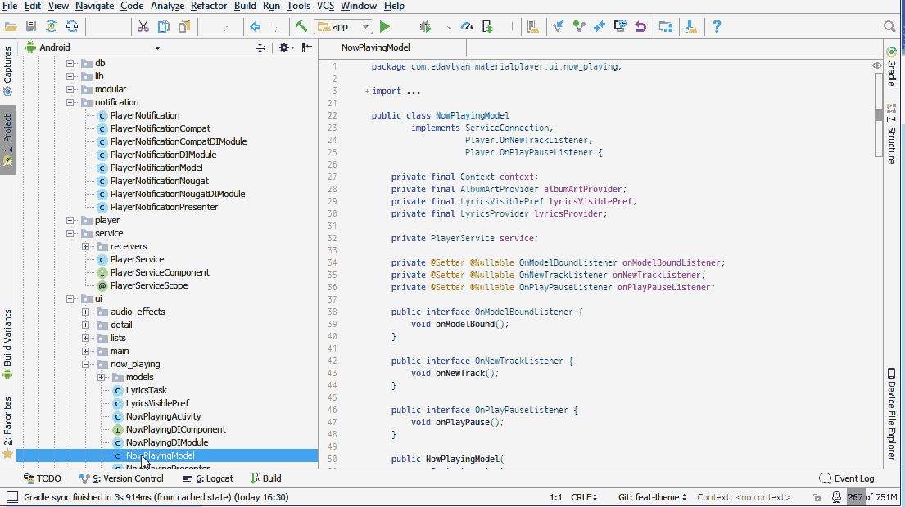
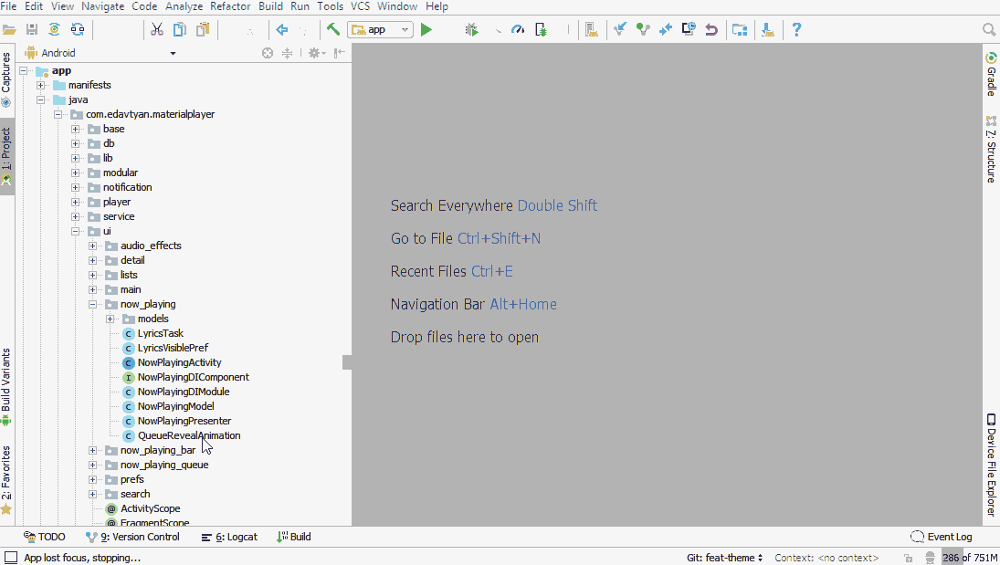

# SublimeTabs

Sublime Text tabs behavior for IntelliJ IDEA

By default, IDEA creates a new tab for each opened file and does not automatically close tabs of unmodified files.
This often leads to bloated tabs pane with many unnecessary tabs open and forces user to mannualy close theme.

This plugin makes tabs in IntelliJ IDEA behave in a similar way they do in Sublime Text. It only keeps recently 
modified tabs open and automatically closes unmodified tabs.

